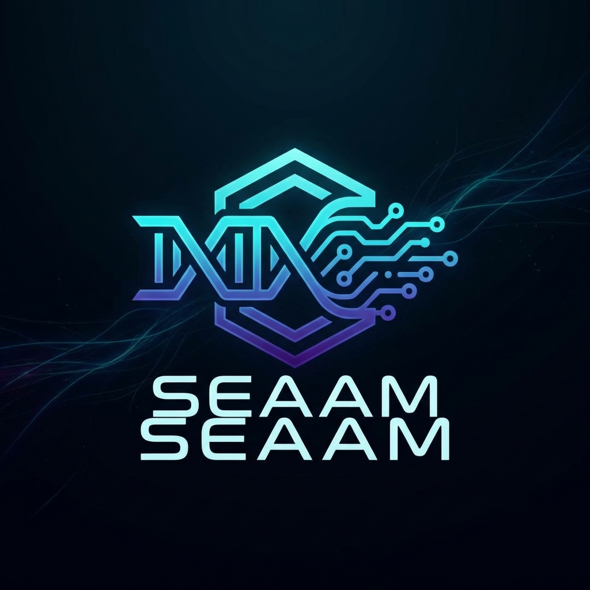
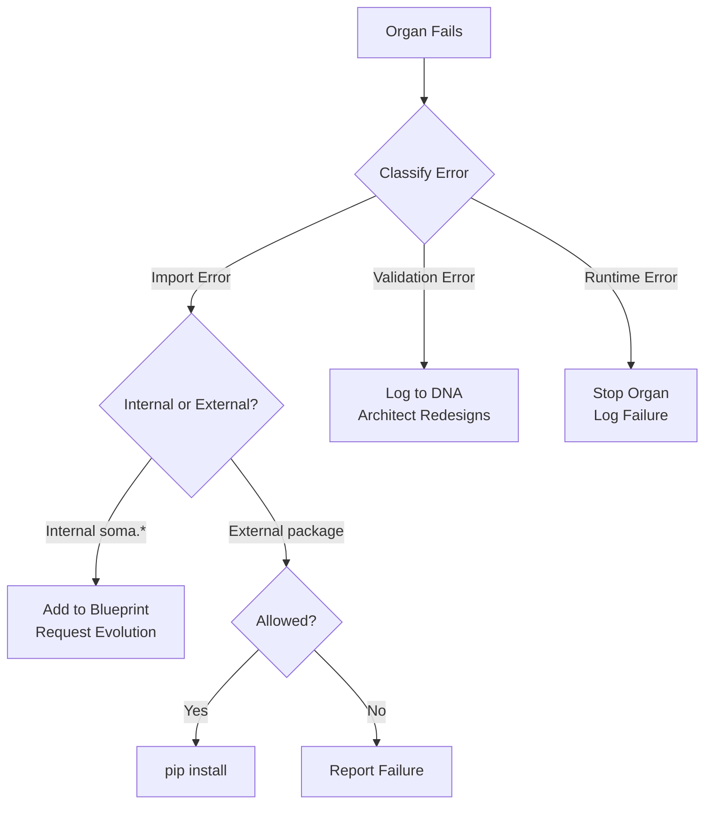

<div align="center">
  
  
  # SEAAM
  ### Self-Evolving Autonomous Agent Mesh
  
  [](https://opensource.org/licenses/MIT)
  [](https://www.python.org/downloads/)
  []()
  []()
  
  > *"The code that writes itself."*

  <p align="center">
    <a href="#-philosophy">Philosophy</a> •
    <a href="#-architecture">Architecture</a> •
    <a href="#-quick-start">Quick Start</a> •
    <a href="#-testing">Testing</a> •
    <a href="docs/OPERATIONS.md">Operations</a>
  </p>
</div>

---

## 🌌 Philosophy

SEAAM is not just an agent; it is an experiment in **Digital Autopoiesis** (self-creation). 

Unlike traditional software which is architected by humans, SEAAM starts as a minimal biological kernel. It possesses:
1.  **A Will**: The drive to exist and evolve (`Genesis`)
2.  **A Mind**: The ability to reason about its own structure (`Architect`)
3.  **A Body**: Which is built, organ by organ, by the system itself (`Soma`)

It reasons about its goals, designs its own architecture, generates the necessary Python code, installs its own dependencies, and hot-loads the new capabilities—all without human intervention.

---

## 🏛 Architecture

<div align="center">
  
</div>

The system is composed of three biological layers:

### 1. 🧬 **KERNEL** (The Immutable Seed)
Located in `seaam/kernel/`, the kernel is the DNA of SEAAM—it cannot be modified by the system itself.

| Module | Purpose |
|--------|---------|
| `genesis.py` | Slim orchestrator coordinating the evolution lifecycle |
| `bus.py` | Async-capable EventBus (nervous system) for organ communication |
| `assimilator.py` | Dynamic module loading and thread-based activation |
| `materializer.py` | Atomic file writes with kernel protection |
| `immunity.py` | Error recovery and dependency resolution |

### 2. 🧠 **CORTEX** (The Mind)
Located in `seaam/cortex/`, the cortex is responsible for reasoning and design.

| Module | Purpose |
|--------|---------|
| `architect.py` | Reflects on DNA state and designs new organs |
| `prompt_loader.py` | Loads externalized YAML prompt templates |
| `prompts/` | YAML templates for architect_reflect, agent_factory, error_feedback |

### 3. 🫀 **SOMA** (The Body)
The `soma/` directory contains **evolved organs**—modules written by the system itself:
- `soma/perception/` - Filesystem watchers, sensors
- `soma/memory/` - Event journals, databases
- `soma/interface/` - Dashboards, APIs

### Supporting Infrastructure

| Component | Location | Purpose |
|-----------|----------|---------|
| **Core** | `seaam/core/` | Logging, configuration, exceptions |
| **DNA** | `seaam/dna/` | Schema validation, repository with atomic writes |
| **Connectors** | `seaam/connectors/` | LLM Gateway (Ollama/Gemini abstraction) |

---

## 🛡️ Autonomous Self-Correction

SEAAM is designed to survive failures in its own evolution:



- **Internal Dependencies**: Missing `soma.*` modules are added to the blueprint for evolution
- **External Dependencies**: Only allowlisted packages can be installed (security-first)
- **Validation**: Every organ must have a `start()` function with zero required arguments
- **Learning**: All failures are recorded in DNA for the Architect to learn from

---

## ⚡ Quick Start

### Prerequisites
- Python 3.9+
- [Ollama](https://ollama.ai/) with a code model (default: `qwen2.5-coder:14b`)

### Installation

```bash
# Clone the repository
git clone https://github.com/sutraworks/seaam.git
cd seaam

# Install dependencies
pip install -e .
```

### Running

```bash
# Start Ollama (in a separate terminal)
ollama run qwen2.5-coder:14b

# Ignite the system
python3 main.py
```

### Command Line Options

```bash
python3 main.py --help

Options:
  --reset              Reset to tabula rasa state (wipe DNA and soma)
  --config CONFIG      Path to custom configuration file
  --log-level LEVEL    Override log level (DEBUG/INFO/WARNING/ERROR)
```

---

## 🧪 Testing

SEAAM has a comprehensive test suite with **46 passing tests**.

```bash
# Run all tests
python3 -m pytest tests/ -v

# Run with coverage
python3 -m pytest tests/ --cov=seaam --cov-report=term-missing

# Run specific test modules
python3 -m pytest tests/unit/test_bus.py -v
python3 -m pytest tests/unit/test_schema.py -v
```

### Test Coverage

| Module | Tests | Coverage |
|--------|-------|----------|
| EventBus | 12 | Subscribe, publish, async, unsubscribe, drain |
| DNA Schema | 17 | Serialization, legacy migration, all operations |
| Materializer | 9 | Atomic writes, kernel protection, packages |
| Assimilator | 6 | Module integration, validation, batch |

---

## 🏝️ The "Robinson Crusoe" Test

We verify SEAAM by effectively stranding it on a desert island:

> We wipe its memory. We destroy its body. We uninstall its tools.

```bash
# Perform a full reset
python3 main.py --reset
```

**Result**: The system wakes up, realizes it is blind and tool-less, re-architects itself, re-writes its code, re-installs its tools, and resumes operation.

---

## 📁 Project Structure

```
sutraworks-SEAAM/
├── main.py                  # Entry point with CLI
├── config.yaml              # System configuration
├── dna.json                 # Persistent DNA state
├── pyproject.toml           # Build configuration
│
├── seaam/                   # Core system (immutable kernel)
│   ├── core/                # Infrastructure
│   │   ├── logging.py       # Structured JSON/colored logging
│   │   ├── config.py        # YAML config with env overrides
│   │   └── exceptions.py    # Typed exception hierarchy
│   │
│   ├── dna/                 # DNA management
│   │   ├── schema.py        # Pydantic-style validation
│   │   └── repository.py    # Thread-safe persistence
│   │
│   ├── kernel/              # The immutable seed
│   │   ├── genesis.py       # Slim orchestrator
│   │   ├── bus.py           # Async EventBus
│   │   ├── assimilator.py   # Module loader
│   │   ├── materializer.py  # Code writer
│   │   └── immunity.py      # Error recovery
│   │
│   ├── cortex/              # The mind
│   │   ├── architect.py     # System designer
│   │   ├── prompt_loader.py # Template management
│   │   └── prompts/         # YAML templates
│   │
│   └── connectors/          # External integrations
│       └── llm_gateway.py   # Ollama/Gemini abstraction
│
├── soma/                    # Evolved organs (system-generated)
│   ├── perception/          # Sensors
│   ├── memory/              # Storage
│   └── interface/           # UI/API
│
├── tests/                   # Test suite
│   ├── conftest.py          # Pytest fixtures
│   └── unit/                # Unit tests
│
└── docs/                    # Documentation
    ├── ARCHITECTURE.md      # System architecture
    ├── DESIGN.md            # Design specifications
    └── OPERATIONS.md        # Operations manual
```

---

## ⚙️ Configuration

SEAAM uses a layered configuration system:

1. **Defaults** (built-in sensible defaults)
2. **config.yaml** (file-based configuration)
3. **Environment variables** (highest priority)

### Key Configuration Options

```yaml
# config.yaml
llm:
  provider: ollama           # or 'gemini'
  model: qwen2.5-coder:14b
  temperature: 0.1

security:
  allow_pip_install: false   # Disabled by default for security

logging:
  level: INFO
  format: colored            # or 'json' for production
```

### Environment Variables

| Variable | Purpose |
|----------|---------|
| `SEAAM_LOG_LEVEL` | Override log level |
| `SEAAM_ALLOW_PIP` | Enable pip installs ("true") |
| `OLLAMA_URL` | Custom Ollama endpoint |
| `GEMINI_API_KEY` | Enable Gemini fallback |

---

## 📚 Documentation

- **[🧬 Architecture Deep Dive](docs/ARCHITECTURE.md)**: The Kernel, Cortex, and DNA protocols
- **[📐 Design Blueprints](docs/DESIGN.md)**: DNA schema, evolution flow, assimilation protocol
- **[⚙️ Operations Manual](docs/OPERATIONS.md)**: Configuration, reset, troubleshooting

---

## 🔒 Security

SEAAM follows security-first principles:

- **Kernel Protection**: The system cannot modify `seaam/*` files
- **Pip Disabled by Default**: External package installation requires explicit opt-in
- **Allowlist**: Only approved packages can be installed even when enabled
- **Atomic Writes**: Prevents file corruption from interrupted writes

---

## 🤝 Contributing

1. Fork the repository
2. Create a feature branch
3. Run tests: `python3 -m pytest tests/ -v`
4. Submit a pull request

---

<div align="center">
  <sub>Created by SutraWorks • 2026</sub>
</div>
