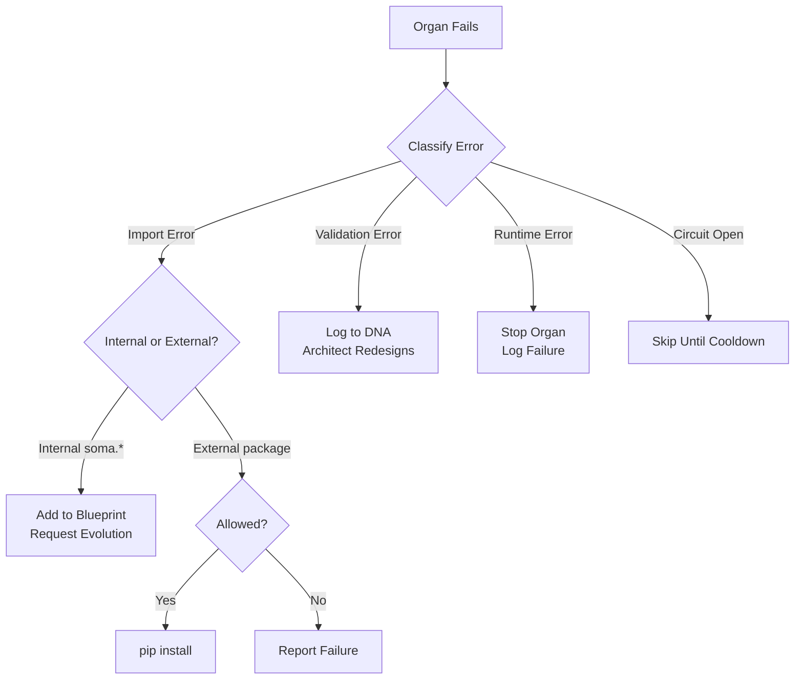

<div align="center">
  

  # Self-Evolving Autonomous Agent
  ### The agent that writes itself

  [](https://opensource.org/licenses/MIT)
  [](https://www.python.org/downloads/)
  []()
  []()

  > *"The code that writes itself."*

  <p align="center">
    <a href="#-philosophy">Philosophy</a> •
    <a href="#-architecture">Architecture</a> •
    <a href="#-quick-start">Quick Start</a> •
    <a href="#-observability">Observability</a> •
    <a href="#-testing">Testing</a> •
    <a href="docs/">Full Docs</a>
  </p>

</div>

---

## Philosophy

The Self-Evolving Autonomous Agent (SEAA) is not just an agent; it is an experiment in **Digital Autopoiesis** (self-creation).

Unlike traditional software which is architected by humans, SEAA starts as a minimal biological kernel. It possesses:
1.  **A Will**: The drive to exist and evolve (`Genesis`)
2.  **A Mind**: The ability to reason about its own structure (`Architect`)
3.  **A Body**: Which is built, organ by organ, by the system itself (`Soma`)
4.  **An Identity**: A persistent sense of self that survives resets (`Identity`)

It reasons about its goals, designs its own architecture, generates the necessary Python code, installs its own dependencies, and hot-loads the new capabilities—all without human intervention.

---

## 📚 Documentation

**All documentation has been organized in the [docs/](docs/) directory.**

| Need | Location |
|------|----------|
| **Installation** | [docs/guides/INSTALL.md](docs/guides/INSTALL.md) |
| **5-Minute Start** | [docs/guides/QUICK_START.md](docs/guides/QUICK_START.md) |
| **Architecture** | [docs/architecture/](docs/architecture/) |
| **Design & Implementation** | [docs/design/](docs/design/) |
| **Project Status** | [docs/evolution/CURRENT_STATUS.md](docs/evolution/CURRENT_STATUS.md) |
| **Full Documentation Index** | [docs/](docs/) |

---

## Architecture

<div align="center">
  
</div>

The system is composed of four biological layers:

### 1. **KERNEL** (The Immutable Seed)
Located in `seaa/kernel/`, the kernel is the DNA of the agent—it cannot be modified by the system itself.

| Module | Purpose |
|--------|---------|
| `genesis.py` | Slim orchestrator coordinating the evolution lifecycle |
| `bus.py` | Async-capable EventBus (nervous system) for organ communication |
| `assimilator.py` | Dynamic module loading and thread-based activation |
| `materializer.py` | Atomic file writes with kernel protection |
| `immunity.py` | Error recovery and dependency resolution |
| `genealogy.py` | Evolutionary memory (local git) and rollback capability |
| `identity.py` | Instance identity (UUID, name, lineage) - survives resets |
| `beacon.py` | Minimal health endpoint for mesh queries |
| `observer.py` | Extended local observation with event streaming |
| `protocols.py` | Observable contracts for mesh interoperability |

### 2. **CORTEX** (The Mind)
Located in `seaa/cortex/`, the cortex is responsible for reasoning and design.

| Module | Purpose |
|--------|---------|
| `architect.py` | Reflects on DNA state and designs new organs |
| `prompt_loader.py` | Loads externalized YAML prompt templates |
| `prompts/` | YAML templates for architect_reflect, agent_factory, error_feedback |

### 3. **SOMA** (The Body)
The `soma/` directory contains **evolved organs**—modules written by the system itself:
- `soma/perception/` - Filesystem watchers, sensors
- `soma/memory/` - Event journals, databases
- `soma/interface/` - Dashboards, APIs
- `soma/extensions/` - Custom metrics, health checks (evolvable)
- `soma/mesh/` - Fleet discovery, remote queries (evolvable)

### 4. **OBSERVABILITY** (The Eyes)
The observability layer provides introspection into the running system:

| Component | Type | Purpose |
|-----------|------|---------|
| `Identity` | Static (Kernel) | Who am I? Survives resets |
| `Beacon` | Static (Kernel) | Minimal health endpoint |
| `Observer` | Static (Kernel) | Local query + event streaming |
| `Protocols` | Static (Kernel) | Mesh-ready contracts |
| `soma.interface.*` | Evolvable | Rich dashboards, TUI |
| `soma.extensions.*` | Evolvable | Custom metrics |

### Supporting Infrastructure

| Component | Location | Purpose |
|-----------|----------|---------|
| **Core** | `seaa/core/` | Logging, configuration, exceptions |
| **DNA** | `seaa/dna/` | Schema validation, repository with atomic writes |
| **Connectors** | `seaa/connectors/` | LLM Gateway (Ollama/Gemini abstraction) |

---

## Autonomous Self-Correction

The agent is designed to survive failures in its own evolution:



- **Code Validation**: AST-based syntax checking, forbidden imports detection (pip, subprocess, eval), start() signature validation
- **Circuit Breaker**: After 3 failures, an organ is skipped for 30 minutes (configurable)
- **Internal Dependencies**: Missing `soma.*` modules are added to the blueprint for evolution
- **External Dependencies**: Only allowlisted packages can be installed (security-first)
- **Validation**: Every organ must have a `start()` function with zero required arguments
- **Learning**: All failures are recorded in DNA for the Architect to learn from
- **Measurable Goals**: Goals can specify required organ patterns and auto-satisfy when met

---

## Quick Start

### Prerequisites
- Python 3.9+
- [Ollama](https://ollama.ai/) with a code model (default: `qwen2.5-coder:14b`)

### Installation

```bash
# Clone the repository
git clone https://github.com/sutraworks/seaa.git
cd seaa

# Install dependencies
pip install -e .
```

### Running

```bash
# Start Ollama (in a separate terminal)
ollama run qwen2.5-coder:14b

# Ignite the system
python3 main.py
```

### Command Line Interface

```bash
python3 main.py --help

# Run the agent (default)
python3 main.py

# Interactive mode (Rich UI + REPL)
python3 main.py -i

# Query commands (no agent startup)
python3 main.py status              # System health
python3 main.py organs              # List organs with health
python3 main.py goals               # Goal satisfaction progress
python3 main.py failures            # Failure records
python3 main.py identity            # Show instance identity
python3 main.py identity --name X   # Set instance name
python3 main.py timeline            # Evolution history
python3 main.py watch               # Live event stream

# Options
python3 main.py --reset             # Reset to tabula rasa
python3 main.py --config FILE       # Custom config file
python3 main.py --log-level DEBUG   # Override log level
```

### Interactive Mode

SEAA includes a best-in-class interactive CLI with Rich terminal UI:

```bash
# Install CLI dependencies
pip install seaa[cli]

# Launch interactive REPL
python3 main.py -i
```

Features:
- **Rich UI**: Tables, panels, and live dashboard
- **Natural Language**: Ask "how are you?" or "show organs"
- **Typo Tolerance**: Auto-corrects "staus" to "status"
- **Tab Completion**: Complete commands and arguments
- **Background Genesis**: Start/stop the agent while interacting

```
● Robinson > how are you?
╭──────────────────────────────────────╮
│  Robinson (713d8815)                 │
├──────────────────────────────────────┤
│  Status:     HEALTHY                 │
│  Organs:     3/3 healthy             │
│  Goals:      2/4 satisfied           │
╰──────────────────────────────────────╯

● Robinson > dashboard    # Live full-screen view
● Robinson > start        # Start Genesis in background
● Robinson > watch        # Stream events
```

See [Interactive CLI Guide](docs/CLI.md) for full documentation.

---

## Observability

SEAA has a built-in observability layer that's always available—even when soma is broken.

### Instance Identity

Each SEAA instance has a persistent identity stored in `.identity.json`:

```bash
$ python3 main.py identity --name Robinson
Instance renamed to: Robinson

$ python3 main.py identity
Instance Identity:
----------------------------------------
ID:       713d8815-6867-409c-87a1-a2ae27aa3276
Name:     Robinson
Genesis:  2026-01-30T08:28:34.921116Z
Lineage:  56271deda1e156e0
```

Identity survives DNA resets—the instance knows who it is even after `--reset`.

### System Status

```bash
$ python3 main.py status

Robinson (713d8815)
========================================
Status:      HEALTHY
Uptime:      3600s
DNA:         56271deda1e156e0

Organs:      3/3 healthy
Goals:       2/4 satisfied
Evolutions:  3
Pending:     0
```

### Organ Health

```bash
$ python3 main.py organs

Organs:
------------------------------------------------------------
  ● ✓  soma.perception.observer
  ● ✓  soma.memory.journal
  ● !  soma.interface.dashboard
        └─ Connection refused on port 5000...
```

### Live Event Stream

```bash
$ python3 main.py watch
Watching events... (Ctrl+C to stop)
------------------------------------------------------------
[14:32:15] organ.evolved: {'organ': 'soma.perception.observer'}
[14:32:16] organ.integrated: {'organ': 'soma.perception.observer'}
[14:32:45] system.heartbeat: {'running_organs': 3, 'pending': 0}
```

### JSON Output

All commands support `--json` for programmatic access:

```bash
$ python3 main.py status --json
{
  "identity": {"id": "713d8815...", "name": "Robinson"},
  "vitals": {
    "alive": true,
    "organ_count": 3,
    "healthy_organs": 3,
    "goals_satisfied": 2,
    "goals_total": 4
  }
}
```

### Mesh-Ready Design

The observability layer is designed for future mesh networks:

| Layer | Scope | Purpose |
|-------|-------|---------|
| **Beacon** | Universal | Minimal health query (works over network) |
| **Observer** | Local | Rich introspection + event streaming |
| **Protocols** | Contract | Observable interfaces for mesh interop |

Any SEAA instance can query another via the Beacon protocol—enabling fleet monitoring.

---

## Testing

The agent has a comprehensive test suite with **129 passing tests**.

```bash
# Run all tests
python3 -m pytest tests/ -v

# Run with coverage
python3 -m pytest tests/ --cov=seaa --cov-report=term-missing

# Run specific test modules
python3 -m pytest tests/unit/test_bus.py -v
python3 -m pytest tests/unit/test_schema.py -v
python3 -m pytest tests/unit/test_cli.py -v
python3 -m pytest tests/integration/test_validation.py -v
```

### Test Coverage

| Module | Tests | Coverage |
|--------|-------|----------|
| EventBus | 12 | Subscribe, publish, async, unsubscribe, drain |
| DNA Schema | 17 | Serialization, legacy migration, all operations |
| Materializer | 16 | Atomic writes, kernel protection, security (path traversal) |
| Assimilator | 6 | Module integration, validation, batch |
| Auto-Immune | 3 | Revert, rollback, failure handling |
| Genealogy | 4 | Git init, commit, revert |
| Observability | 20 | Identity, Beacon, Observer, thread-safety |
| **CLI** | **40** | Fuzzy matching, natural language, formatters |
| **Integration** | **28** | Code validation, circuit breaker, goals, config |

---

## The "Robinson Crusoe" Test

We verify the agent by effectively stranding it on a desert island:

> We wipe its memory. We destroy its body. We uninstall its tools.

```bash
# Perform a full reset
python3 main.py --reset
```

**Result**: The system wakes up, realizes it is blind and tool-less, re-architects itself, re-writes its code, re-installs its tools, and resumes operation.

**But it remembers who it is.** The identity persists across resets.

---

## Project Structure

```
sutraworks-SEAA/
├── main.py                  # Entry point with CLI commands
├── config.yaml              # System configuration
├── dna.json                 # Persistent DNA state
├── .identity.json           # Instance identity (survives reset)
├── pyproject.toml           # Build configuration
│
├── seaa/                   # Core system (immutable kernel)
│   ├── core/                # Infrastructure
│   │   ├── logging.py       # Structured JSON/colored logging
│   │   ├── config.py        # YAML config with env overrides
│   │   └── exceptions.py    # Typed exception hierarchy
│   │
│   ├── dna/                 # DNA management
│   │   ├── schema.py        # Pydantic-style validation
│   │   └── repository.py    # Thread-safe persistence
│   │
│   ├── kernel/              # The immutable seed
│   │   ├── genesis.py       # Slim orchestrator
│   │   ├── bus.py           # Async EventBus
│   │   ├── assimilator.py   # Module loader
│   │   ├── materializer.py  # Code writer
│   │   ├── immunity.py      # Error recovery
│   │   ├── identity.py      # Instance identity
│   │   ├── beacon.py        # Health endpoint
│   │   ├── observer.py      # Local introspection
│   │   └── protocols.py     # Observable contracts
│   │
│   ├── cortex/              # The mind
│   │   ├── architect.py     # System designer
│   │   ├── prompt_loader.py # Template management
│   │   └── prompts/         # YAML templates
│   │
│   ├── cli/                 # Interactive CLI (NEW)
│   │   ├── repl.py          # REPL loop with history
│   │   ├── commands.py      # Command registry
│   │   ├── runtime.py       # Background Genesis manager
│   │   ├── parsers/         # Fuzzy + natural language
│   │   └── ui/              # Rich tables, panels, dashboard
│   │
│   └── connectors/          # External integrations
│       └── llm_gateway.py   # Ollama/Gemini abstraction
│
├── soma/                    # Evolved organs (system-generated)
│   ├── perception/          # Sensors
│   ├── memory/              # Storage
│   ├── interface/           # UI/API (evolvable)
│   └── extensions/          # Custom metrics (evolvable)
│
├── tests/                   # Test suite
│   ├── conftest.py          # Pytest fixtures
│   └── unit/                # Unit tests
│
└── docs/                    # Documentation
    ├── ARCHITECTURE.md      # System architecture
    ├── DESIGN.md            # Design specifications
    ├── OPERATIONS.md        # Operations manual
    ├── CLI.md               # Interactive CLI guide (NEW)
    └── API.md               # API reference
```

---

## Configuration

The agent uses a layered configuration system:

1. **Defaults** (built-in sensible defaults)
2. **config.yaml** (file-based configuration)
3. **Environment variables** (highest priority)

### Key Configuration Options

```yaml
# config.yaml
llm:
  provider: ollama           # or 'gemini'
  model: qwen2.5-coder:14b
  temperature: 0.1

metabolism:
  cycle_interval_seconds: 30
  max_organs_per_cycle: 3
  max_concurrent_organs: 20  # Resource limit
  max_total_organs: 50       # Resource limit

circuit_breaker:
  max_attempts: 3            # Failures before circuit opens
  cooldown_minutes: 30       # Wait time before retry

security:
  allow_pip_install: false   # Disabled by default for security

logging:
  level: INFO
  format: colored            # or 'json' for production
```

### Environment Variables

| Variable | Purpose |
|----------|---------|
| `SEAA_LOG_LEVEL` | Override log level |
| `SEAA_ALLOW_PIP` | Enable pip installs ("true") |
| `SEAA_WATCH_PATH` | Custom path for filesystem observer |
| `OLLAMA_URL` | Custom Ollama endpoint |
| `GEMINI_API_KEY` | Enable Gemini fallback |

---

## Documentation

- **[Architecture Deep Dive](docs/ARCHITECTURE.md)**: The Kernel, Cortex, DNA, and Observability protocols
- **[Design Blueprints](docs/DESIGN.md)**: DNA schema, evolution flow, observability design
- **[Operations Manual](docs/OPERATIONS.md)**: Configuration, CLI commands, troubleshooting
- **[Interactive CLI Guide](docs/CLI.md)**: REPL, natural language, Rich UI components
- **[API Reference](docs/API.md)**: Complete API documentation

---

## Security

The agent follows security-first principles:

- **Kernel Protection**: The system cannot modify `seaa/*` files
- **Path Traversal Protection**: Module names are strictly validated with regex patterns
- **Module Name Validation**: Only `soma.*` with valid Python identifiers can be imported
- **Code Validation**: AST-based validation rejects:
  - Syntax errors
  - Forbidden imports (`pip`, `subprocess`, `os.system`, `eval`, `exec`, `ctypes`, `socket`, `pickle`, etc.)
  - Star imports from non-seaa modules (`from os import *`)
  - Missing or invalid `start()` function signatures
- **Prompt Injection Protection**: Error messages are sanitized before embedding in LLM prompts
- **DNA Integrity**: SHA-256 hash verification detects file tampering
- **Pip Disabled by Default**: External package installation requires explicit opt-in
- **Allowlist**: Only approved packages can be installed even when enabled
- **Atomic Writes**: Prevents file corruption from interrupted writes
- **Resource Limits**: Configurable max organs to prevent runaway growth
- **Circuit Breaker**: Failing organs are temporarily disabled to prevent loops

---

## Contributing

1. Fork the repository
2. Create a feature branch
3. Run tests: `python3 -m pytest tests/ -v`
4. Submit a pull request

---

<div align="center">
  <sub>Created by SutraWorks • 2026</sub>
</div>
