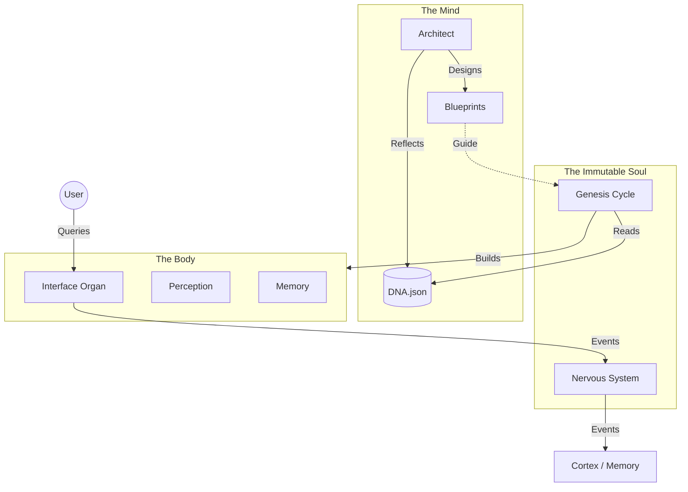

# 🧬 System Architecture

SEAAM is fundamentally different from traditional software architectures. Instead of a static codebase, it is a dynamic biological system designed to grow and heal.

## 🗺 High-Level Map



## 1. The Kernel (Immutable)
The Kernel is the only "hard-coded" part of the system. It enables life but does not dictate form.

### `seaam.kernel.genesis`
The "Will to Live". This is the main loop.
- **Awakening**: Loads DNA, initializes the Architect.
- **Evolution**: Asks Architect for blueprints, uses Gateway to generate code.
- **Assimilation**: Hot-loads the new Python modules (`active_modules`).
- **Immunity**: If a module crashes due to missing libraries, Genesis installs them via `pip` and reboots.

### `seaam.connectors.llm_gateway`
The "Voice of God".
- Abstracts the connection to the LLM (Ollama or Gemini).
- Cleans and sanitizes the code returned by the LLM (e.g., stripping markdown).

## 2. The Cortex (The Mind)
### `seaam.cortex.architect`
 The intelligent agent responsible for system design.
- **Reflect**: Looks at `failures` and `goals` in `dna.json`.
- **Design**: Generates a JSON implementation plan (Thought) for the next necessary module.
- **Example Thought**:
  ```json
  {
    "module_name": "seaam.perception.file_watcher",
    "description": "A module that uses watchdog to monitor..."
  }
  ```

## 3. The Soma (The Body)
These are **not present** at start. They are written by the system itself.
Common evolved organs include:
- `seaam.perception.observer`: Watches the filesystem.
- `seaam.memory.journal`: Logs events to a database or file.
- `seaam.interface.dashboard`: A Streamlit or Terminal UI.
