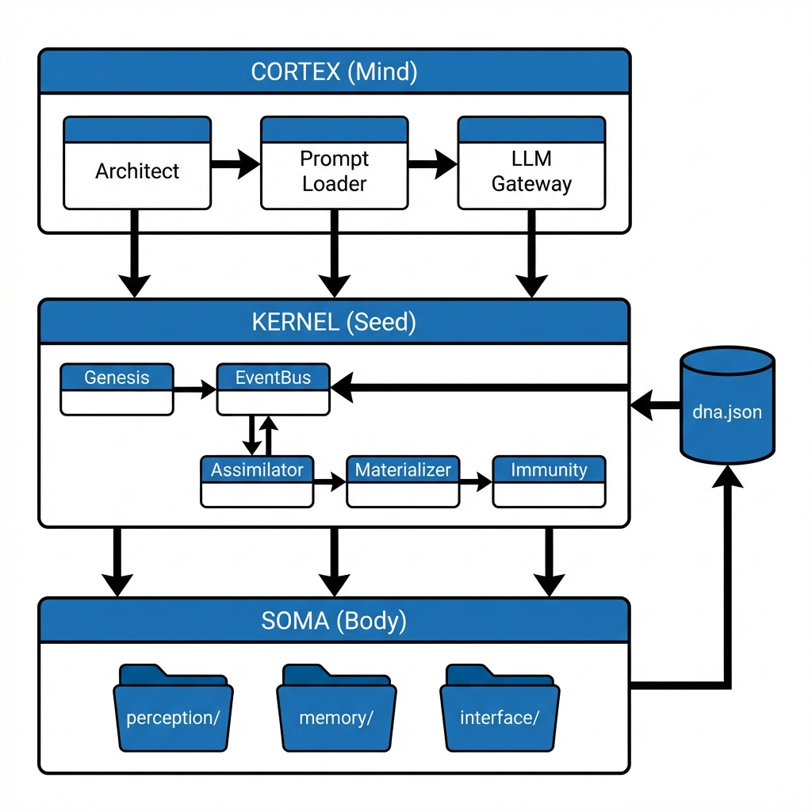
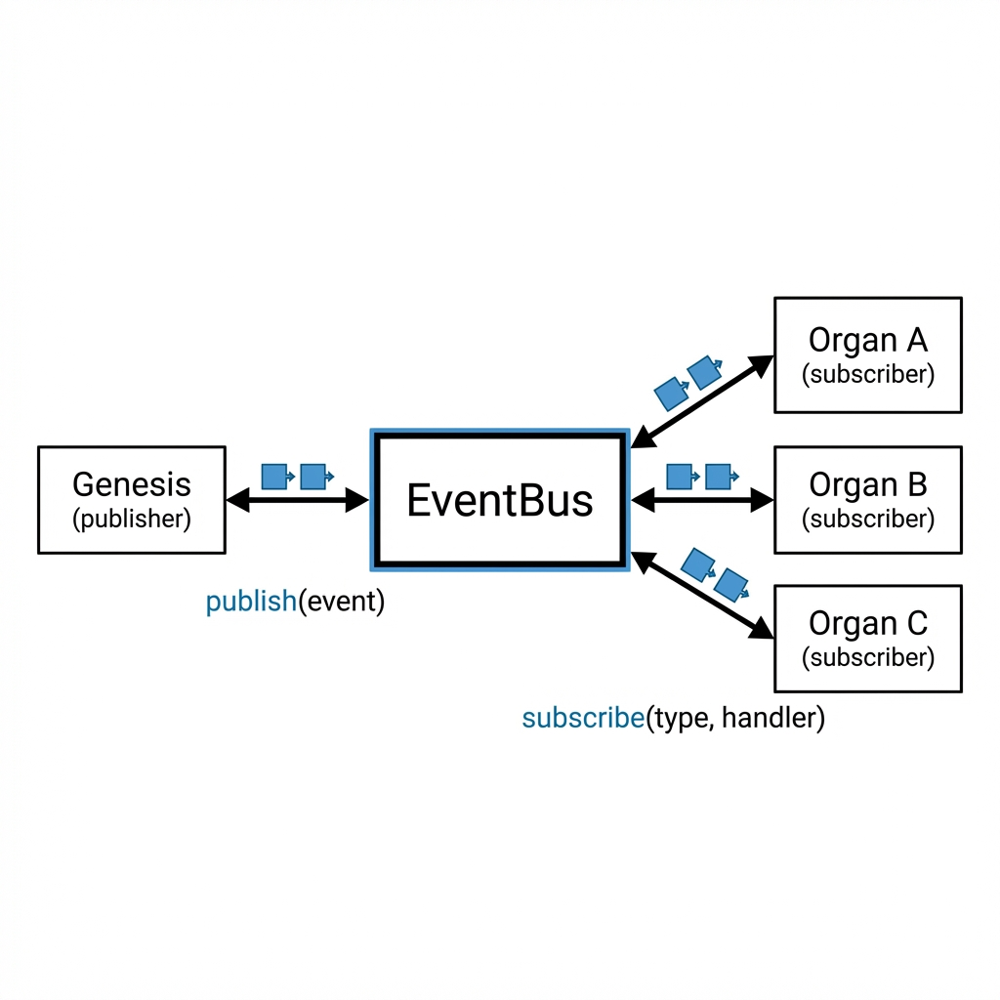
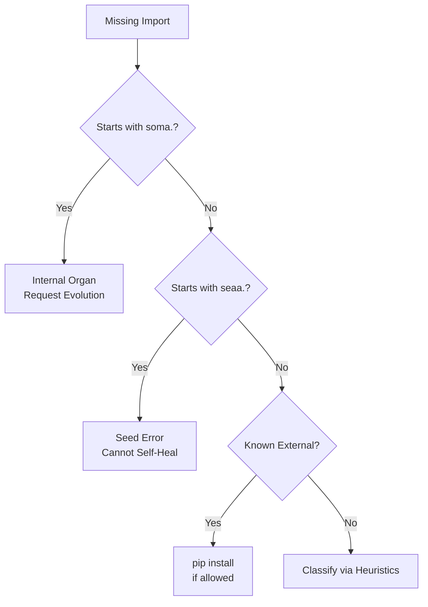
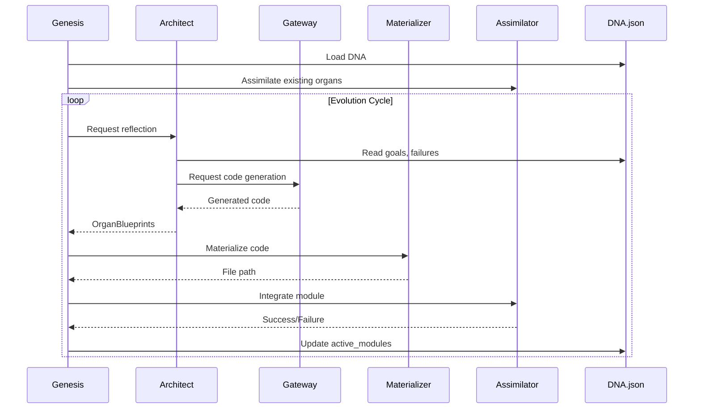
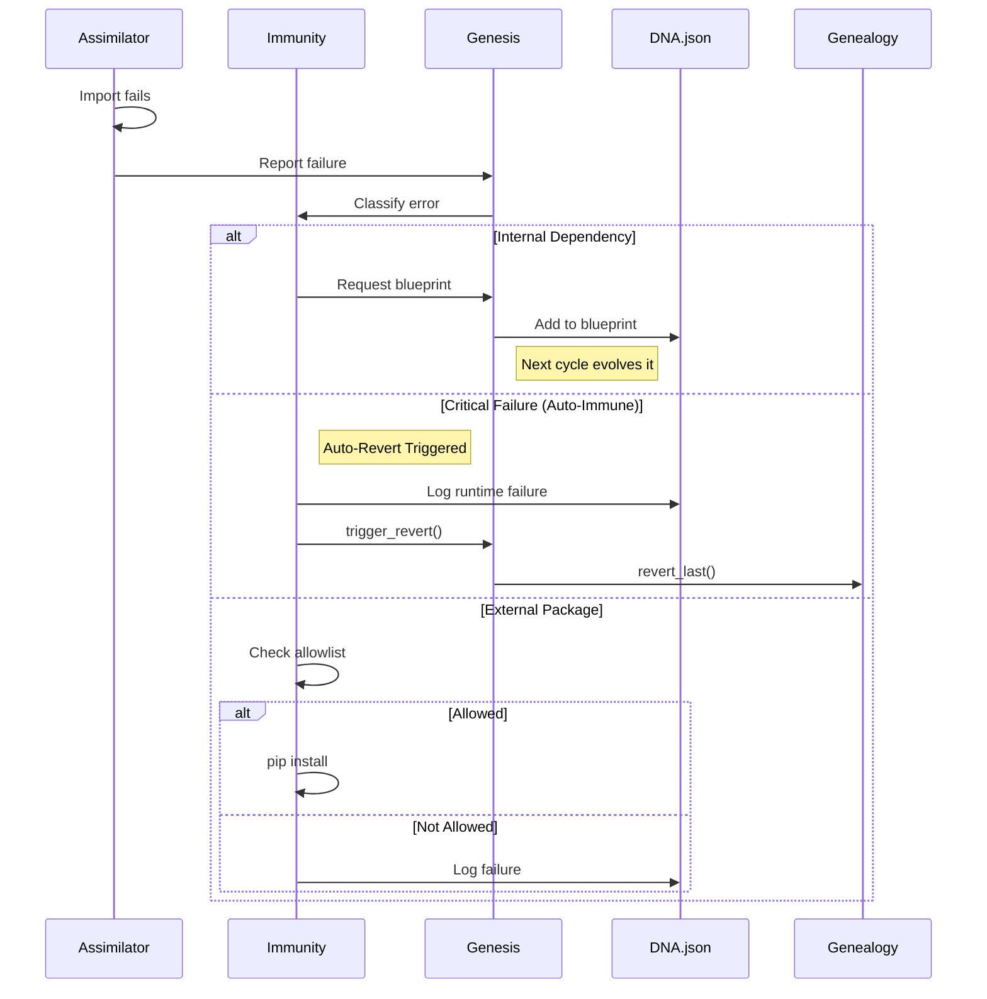

# 🧬 System Architecture

SEAA is fundamentally different from traditional software architectures. Instead of a static codebase, it is a **dynamic biological system** designed to grow, heal, and evolve autonomously.

<div align="center">
  
</div>

---

## 🗺 High-Level Overview

```mermaid
graph TD
    User((User)) -->|Queries| Interface[Interface Organ]
    Interface -->|Events| Bus[Nervous System]
    Bus -->|Events| Memory[Memory Organ]
    
    subgraph KERNEL [The Immutable Seed - seaa/kernel/]
        Genesis[Genesis Orchestrator]
        Bus
        Assimilator[Assimilator]
        Materializer[Materializer]
        Immunity[Immunity System]
        Genealogy[Genealogy (Git)]
    end
    
    subgraph CORTEX [The Mind - seaa/cortex/]
        Architect[Architect] -->|Reflects| DNA[(DNA.json)]
        Architect -->|Uses| PromptLoader[Prompt Loader]
        PromptLoader -->|Loads| Prompts[YAML Templates]
    end
    
    subgraph SOMA [The Body - soma/]
        Perception[perception/]
        Memory
        Interface
    end
    
    subgraph CONNECTORS [External - seaa/connectors/]
        Gateway[LLM Gateway]
        Gateway -->|Ollama| Ollama[Local LLM]
        Gateway -->|Gemini| Gemini[Cloud LLM]
    end
    
    Genesis -->|Reads| DNA
    Genesis -->|Delegates| Assimilator
    Genesis -->|Delegates| Materializer
    Genesis -->|Delegates| Immunity
    Genesis -->|Asks| Architect
    Architect -->|Requests Code| Gateway
    Materializer -->|Writes| SOMA
    Assimilator -->|Hot-loads| SOMA
```

---

## 1. The Kernel (`seaa/kernel/`)

The Kernel is the **immutable core**—it enables life but does not dictate form. It cannot be modified by the system itself.

### `genesis.py` - The Slim Orchestrator

The "Primal Will". A lightweight coordinator (~280 LOC) that delegates all complex logic to specialized components.

**Responsibilities:**
- **Awakening**: Loads DNA, initializes components
- **Evolution**: Coordinates the reflect → design → generate → materialize → assimilate cycle
- **Lifecycle**: Signal handling, graceful shutdown
- **Event Emission**: Publishes lifecycle events to the bus

```python
# Simplified genesis flow
class Genesis:
    def __init__(self):
        self.dna_repo = DNARepository()
        self.assimilator = Assimilator(on_failure=self._handle_failure)
        self.materializer = Materializer()
        self.immunity = Immunity(on_blueprint_needed=self._request_blueprint)
        self.architect = Architect(on_code_request=self.gateway.generate_code)
        self.gateway = ProviderGateway()
    
    def awaken(self):
        self.dna = self.dna_repo.load_or_create()
        self._assimilate_existing()
        self._evolution_cycle()
```

### `bus.py` - The Nervous System

An **async-capable EventBus** that serves as the central communication mechanism.

<div align="center">
  
</div>

**Features:**
| Feature | Description |
|---------|-------------|
| Sync/Async | Both `publish()` (sync) and `publish_async()` (queued) |
| Unsubscribe | `handle.unsubscribe()` prevents memory leaks |
| Correlation IDs | Track event chains across the system |
| Timestamps | All events have creation timestamps |
| Backpressure | Queue-based with configurable limits |
| Graceful Shutdown | `stop_worker(drain=True)` processes remaining events |

```python
# Usage example
from seaa.kernel.bus import bus, subscribe, publish, Event

# Subscribe to events
handle = subscribe("organ.started", lambda e: print(f"Started: {e.data}"))

# Publish events
publish(Event(event_type="organ.started", data="soma.perception.observer"))

# Cleanup
handle.unsubscribe()
```

### `assimilator.py` - Module Integration

Responsible for **dynamic module loading** and thread-based activation.

**Flow:**
1. **Import**: `importlib.import_module()` with cache invalidation
2. **Validate**: Check for `start()` function with zero required args
3. **Activate**: Spawn daemon thread to run `start()`
4. **Track**: Monitor running organs

```python
class Assimilator:
    def integrate(self, module_name: str) -> bool:
        module = self._import_module(module_name)
        
        # Validation
        if not hasattr(module, "start"):
            raise ValidationFailedError(module_name, "Missing start()")
        
        # Activation
        thread = OrganThread(module_name, module.start)
        thread.start()
        self.running_organs[module_name] = thread
        return True
```

### `materializer.py` - Code Writer

Writes generated organ code to the filesystem with **safety guarantees**.

**Features:**
- **Atomic Writes**: Write to temp file, then rename (prevents corruption)
- **Package Structure**: Auto-creates `__init__.py` in all directories
- **Kernel Protection**: Cannot write to `seaa/*` paths

```python
class Materializer:
    def materialize(self, module_name: str, code: str) -> Path:
        self._check_protection(module_name)  # Raises if protected
        file_path = self._module_to_path(module_name)
        self._ensure_package_structure(file_path.parent)
        self._atomic_write(file_path, code)
        return file_path
```

### `immunity.py` - Error Recovery

The healing system for **dependency resolution** and error classification.

**Classification Logic:**


**Security:**
- Pip install disabled by default (`allow_pip_install: false`)
- Only allowlisted packages can be installed
- Pattern matching instead of hardcoded lists

---

## 2. The Cortex (`seaa/cortex/`)

The Cortex is the **intelligent reasoning layer**.

### `architect.py` - System Designer

The intelligent agent responsible for system design using **externalized prompts**.

**Responsibilities:**
- **Reflect**: Analyze DNA state (goals, failures, blueprint)
- **Design**: Propose new organs to fulfill goals
- **Learn**: Use failure history to improve designs

```python
class Architect:
    def reflect(self, dna: DNA) -> List[OrganBlueprint]:
        # Load externalized prompt
        prompt = prompt_loader.render("architect_reflect", 
            goals=dna.get_goals_text(),
            blueprint=dna.get_blueprint_summary(),
            failures=dna.get_failure_summary()
        )
        
        # Get LLM response
        response = self.on_code_request(prompt)
        
        # Parse and return blueprints
        return self._parse_response(response)
```

### `prompt_loader.py` - Template Management

Loads and renders **YAML prompt templates** with simple variable substitution.

**Features:**
- Caching for performance
- Jinja2-lite rendering (no dependency required)
- Works with or without PyYAML installed

**Template Format:**
```yaml
# seaa/cortex/prompts/architect_reflect.yaml
name: architect_reflect
version: 2
description: System reflection and design prompt
variables: [goals, blueprint, failures]
template: |
  You are SEAA's Architect. Analyze the current system state:
  
  ## Goals
  {{ goals }}
  
  ## Current Blueprint
  {{ blueprint }}
  
  ## Recent Failures
  {{ failures }}
  
  Respond with JSON only...
```

---

## 3. The Connectors (`seaa/connectors/`)

### `llm_gateway.py` - LLM Provider Abstraction

Abstracts LLM providers with **comprehensive code validation and retry logic**.

**Providers:**
| Provider | Configuration | Features |
|----------|---------------|----------|
| Ollama | `OLLAMA_URL`, `OLLAMA_MODEL` | Local, fast, default |
| Gemini | `GEMINI_API_KEY` | Cloud fallback |

**Code Validation (`validate_code()`):**
The gateway performs comprehensive AST-based validation:

1. **Syntax Check**: `ast.parse()` for Python syntax validation
2. **Forbidden Imports**: Rejects dangerous imports:
   - `pip`, `subprocess`, `os.system`, `os.popen`
   - `eval`, `exec`, `compile`, `__import__`
3. **Start Function**: Validates `start()` exists with zero required args

```python
class ProviderGateway:
    def validate_code(self, code: str, module_name: str) -> Tuple[bool, Optional[str]]:
        # 1. AST syntax check
        try:
            tree = ast.parse(code)
        except SyntaxError as e:
            return False, f"Syntax error at line {e.lineno}: {e.msg}"

        # 2. Check forbidden imports via AST walk
        for node in ast.walk(tree):
            if isinstance(node, ast.Import):
                # Check against FORBIDDEN_IMPORTS

        # 3. Validate start() signature
        return self._validate_start_signature(tree)

    def generate_code(self, module_name: str, description: str,
                      active_modules: Optional[List[str]] = None) -> Optional[str]:
        # Pass active_modules to LLM for context
        prompt = prompt_loader.render("agent_factory",
            module_name=module_name,
            description=description,
            active_modules=active_modules or []
        )

        for attempt in range(self.max_retries):
            code = self._call_provider(prompt)
            code = self._clean_code(code)

            is_valid, error = self.validate_code(code, module_name)
            if is_valid:
                return code

            prompt = self._add_error_feedback(prompt, error)

        return None
```

---

## 4. The DNA (`seaa/dna/`)

The DNA is the **persistent memory** of the organism.

### `schema.py` - Data Models

Pydantic-style dataclasses with validation and legacy migration.

**Core Types:**
```python
@dataclass
class Goal:
    description: str
    priority: int = 1
    satisfied: bool = False
    created_at: str
    required_organs: List[str] = []  # Patterns for auto-satisfaction, e.g., ["soma.perception.*"]

@dataclass
class OrganBlueprint:
    name: str
    description: str
    dependencies: List[str]
    created_at: str
    version: int = 1

@dataclass
class Failure:
    module_name: str
    error_type: FailureType  # IMPORT, VALIDATION, RUNTIME, GENERATION, MATERIALIZATION
    error_message: str
    timestamp: str
    attempt_count: int = 1
    context: Dict[str, Any]
    # Circuit breaker fields
    circuit_open: bool = False
    circuit_opened_at: Optional[str] = None

@dataclass
class DNA:
    goals: List[Goal]
    blueprint: Dict[str, OrganBlueprint]
    failures: List[Failure]
    active_modules: List[str]
    metadata: DNAMetadata

    # Circuit breaker methods
    def should_attempt(self, module_name: str, max_attempts: int, cooldown_minutes: int) -> bool
    def open_circuit(self, module_name: str) -> None
    def is_circuit_open(self, module_name: str) -> bool
    def reset_circuit(self, module_name: str) -> None

    # Goal satisfaction
    def check_goal_satisfaction(self) -> int  # Returns count of newly satisfied goals
```

### `repository.py` - Persistence

Thread-safe DNA persistence with **atomic writes and backups**.

**Features:**
- Atomic writes (temp file + rename)
- Automatic backups on save
- Lock-based thread safety
- Legacy format migration

---

## 5. The Core (`seaa/core/`)

Foundational infrastructure used throughout the system.

### `logging.py` - Structured Logging

Production-ready logging with **two formats**:

| Format | Use Case | Output |
|--------|----------|--------|
| `colored` | Development | Human-readable with colors |
| `json` | Production | Machine-parseable JSON |

```python
from seaa.core.logging import get_logger

logger = get_logger("genesis")
logger.info("System awakening", cycles=0, organs=5)
```

### `config.py` - Configuration Management

Layered configuration with **priority system**:

1. Built-in defaults → 2. `config.yaml` → 3. Environment variables

```python
from seaa.core.config import config

# Access configuration
model = config.llm.model
allow_pip = config.security.allow_pip_install
```

### `exceptions.py` - Typed Exception Hierarchy

```
SEAAError (base)
├── DNAError
│   ├── DNAValidationError
│   ├── DNANotFoundError
│   └── DNACorruptedError
├── EvolutionError
│   ├── BlueprintError
│   ├── CodeGenerationError
│   └── MaterializationError
├── AssimilationError
│   ├── ImportFailedError
│   ├── ValidationFailedError
│   └── ActivationFailedError
├── ImmunityError
│   ├── DependencyResolutionError
│   └── KernelProtectionError
└── GatewayError
    ├── ProviderUnavailableError
    ├── RateLimitError
    └── InvalidResponseError
```

---

## 6. The Soma (`soma/`)

The Soma is the **evolved body**—modules written by the system itself. These directories and files are created at runtime.

**Common Organs:**
- `soma/perception/observer.py` - Filesystem watcher
- `soma/memory/journal.py` - Event logging
- `soma/interface/dashboard.py` - Streamlit UI

**Organ Requirements:**
```python
# Every organ must have:
def start():
    """Zero-argument entry point."""
    # Organ logic here
    pass
```

---

## 7. Data Flow

### Evolution Cycle



### Error Recovery Flow



---

## 8. Security Model

SEAA follows a **security-first** design:

| Protection | Mechanism |
|------------|-----------|
| Kernel Immutability | Materializer rejects writes to `seaa/*` |
| Code Validation | AST-based syntax + forbidden import checking |
| Forbidden Imports | `pip`, `subprocess`, `os.system`, `eval`, `exec` blocked |
| Pip Disabled | `allow_pip_install: false` by default |
| Package Allowlist | Only approved packages can be installed |
| Atomic Writes | Prevents file corruption |
| Thread Isolation | Each organ runs in its own daemon thread |
| Resource Limits | `max_concurrent_organs`, `max_total_organs` caps |
| Circuit Breaker | Failing organs auto-disabled after max attempts |
| Config Validation | Invalid configuration rejected at startup |

---

## 9. Testing Architecture

The test suite covers all critical components with **81 tests**.

```
tests/
├── conftest.py              # Shared fixtures
│   ├── temp_dir             # Isolated temp directories
│   ├── sample_dna           # Test DNA data
│   ├── mock_llm             # LLM response mocking
│   ├── reset_event_bus      # EventBus cleanup
│   └── soma_structure       # Temp soma/ directory
│
├── unit/
│   ├── test_bus.py          # EventBus (12 tests)
│   ├── test_schema.py       # DNA Schema (17 tests)
│   ├── test_materializer.py # Materializer (9 tests)
│   ├── test_assimilator.py  # Assimilator (6 tests)
│   ├── test_genealogy.py    # Git memory (4 tests)
│   └── test_auto_immune.py  # Auto-revert (3 tests)
│
└── integration/
    └── test_validation.py   # Integration tests (28 tests)
        ├── TestCodeValidation      # AST validation, forbidden imports
        ├── TestCircuitBreaker      # Circuit open/close/cooldown
        ├── TestGoalSatisfaction    # Pattern matching, auto-satisfy
        └── TestConfigValidation    # Config bounds checking
```

**Run tests:**
```bash
python3 -m pytest tests/ -v
python3 -m pytest tests/integration/ -v  # Integration only
```
