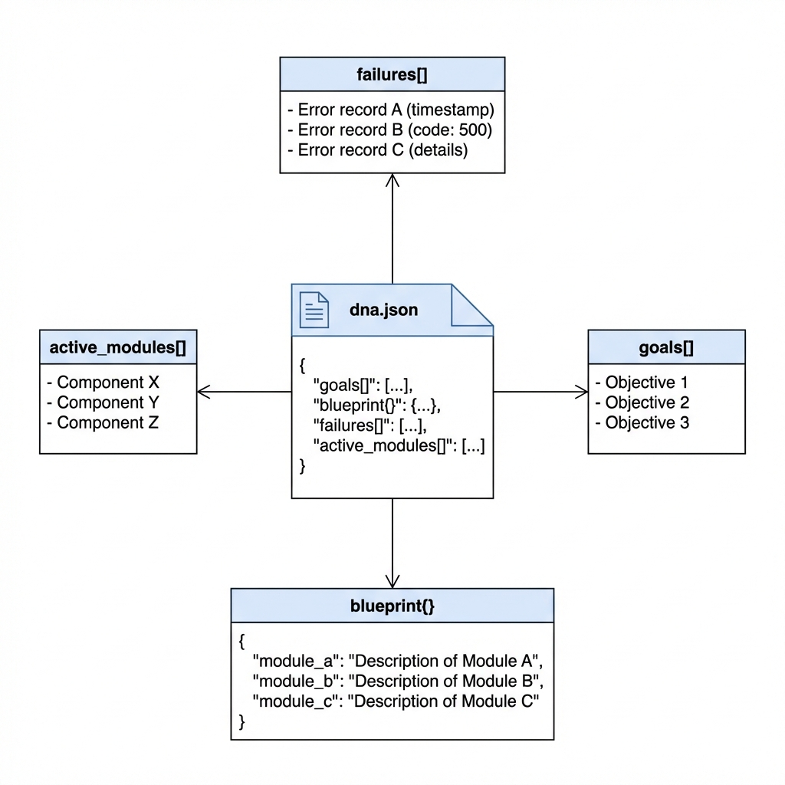
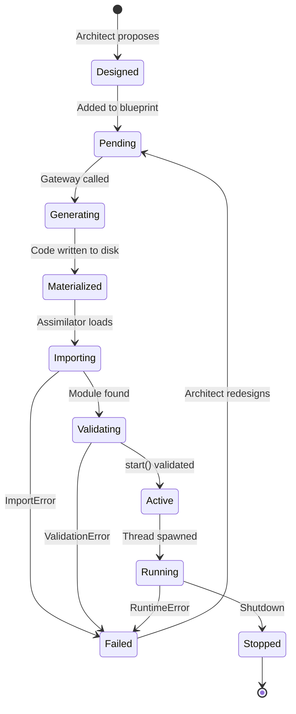
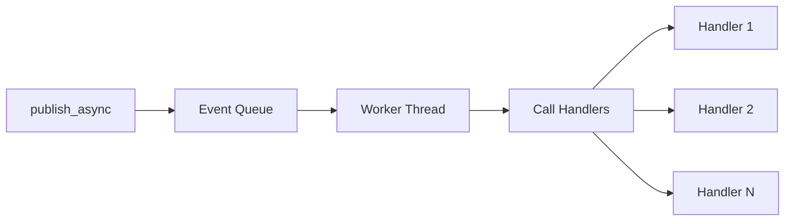

```mermaid
sequenceDiagram
    participant DNA as 🧬 DNA.json
    participant G as ⚡ Genesis
    participant A as 🧠 Architect
    participant GW as ☁️ Gateway
    participant M as 📝 Materializer
    participant AS as 🔄 Assimilator

    rect rgb(40, 40, 60)
        Note over G: AWAKENING
        G->>DNA: 1. Load DNA state
        G->>AS: 2. Assimilate existing organs
    end
    
    rect rgb(60, 40, 40)
        Note over G: METABOLIC LOOP
        loop Every cycle_interval_seconds
            G->>A: 3. Request reflection
            A->>DNA: 4. Observe (goals, failures, body)
            A->>A: 5. Orient (identify gaps)
            A->>GW: 6. Decide (request code)
            GW-->>A: 7. Generated code
            A-->>G: 8. OrganBlueprints
            
            G->>M: 9. Act (materialize code)
            G->>AS: 10. Assimilate (hot-load)
            G->>DNA: 11. Update state
        end
    end
```

# 📐 SEAAM Design Specification

This document details the internal design patterns, data structures, and protocols that power SEAAM's self-evolution capabilities.

<div align="center">
  
  <p><em>The Genesis Loop - OODA cycle for autonomous evolution</em></p>
</div>

---

## 1. The Genesis Loop (OODA)

The core driver of SEAAM is the **Genesis Loop**, an implementation of the OODA loop (Observe-Orient-Decide-Act) applied to autonomous software engineering.



---

## 2. DNA Structure (`dna.json`)

The DNA is the **single source of truth** for the organism. It persists across reboots and tracks the complete system state.

<div align="center">
  
</div>

### Current Schema (v1.0)

```json
{
  "goals": [
    {
      "text": "I must be able to perceive the file system.",
      "created_at": "2026-01-30T12:00:00Z",
      "achieved": false
    },
    {
      "text": "I must have persistent memory.",
      "created_at": "2026-01-30T12:00:00Z",
      "achieved": false
    }
  ],
  "blueprint": {
    "soma.perception.observer": {
      "description": "Monitors filesystem for changes using watchdog",
      "dependencies": ["watchdog"],
      "created_at": "2026-01-30T12:05:00Z",
      "version": 1
    }
  },
  "failures": [
    {
      "module_name": "soma.perception.observer",
      "error_type": "import",
      "message": "No module named 'watchdog'",
      "context": {"attempt": 1},
      "timestamp": "2026-01-30T12:06:00Z",
      "attempt_count": 1
    }
  ],
  "active_modules": [
    "soma.perception.observer"
  ],
  "metadata": {
    "system_version": "1.0.0",
    "system_name": "SEAAM",
    "created_at": "2026-01-30T12:00:00Z",
    "last_evolution_time": "2026-01-30T12:10:00Z",
    "evolution_count": 3,
    "last_successful_organ": "soma.perception.observer"
  }
}
```

### DNA Operations

| Operation | Method | Description |
|-----------|--------|-------------|
| Add Goal | `dna.add_goal(text)` | Add a new goal |
| Add Blueprint | `dna.add_blueprint(name, desc)` | Register organ design |
| Update Blueprint | `dna.update_blueprint(name, desc)` | Modify existing design |
| Add Failure | `dna.add_failure(name, type, msg)` | Log an error |
| Clear Failure | `dna.clear_failure(name)` | Remove after fix |
| Mark Active | `dna.mark_active(name)` | Track running organs |
| Get Pending | `dna.get_pending_blueprints()` | Blueprints not yet active |

### Legacy Format Migration

The system automatically migrates old DNA formats:

```python
# Old format (simple strings)
{
  "goals": ["I must perceive."],
  "blueprint": {"soma.observer": "A module that watches files"}
}

# Automatically converted to new format
{
  "goals": [{"text": "I must perceive.", "created_at": "...", "achieved": false}],
  "blueprint": {
    "soma.observer": {
      "description": "A module that watches files",
      "dependencies": [],
      "created_at": "...",
      "version": 1
    }
  }
}
```

---

## 3. Organ Lifecycle

Every organ goes through a defined lifecycle managed by the Kernel.



### Organ Requirements

Every organ **must** follow this contract:

```python
"""
Module: soma.{category}.{name}

Every organ must define a global start() function that:
1. Takes zero required arguments
2. Contains the organ's main logic
3. Can be long-running (runs in its own thread)
"""

def start():
    """
    Entry point for the organ.
    
    This function is called by the Assimilator in a daemon thread.
    It should contain the organ's main loop or logic.
    """
    # Initialize
    setup_resources()
    
    # Main loop (optional, for continuous organs)
    while True:
        do_work()
        time.sleep(interval)
```

### Validation Rules

The Assimilator validates organs against these rules:

| Rule | Check | Error Type |
|------|-------|------------|
| Has `start` | `hasattr(module, "start")` | ValidationFailedError |
| `start` is callable | `callable(module.start)` | ValidationFailedError |
| Zero required args | `len(required_params) == 0` | ValidationFailedError |

---

## 4. Assimilation Protocol

When an organ is "Materialized" (code written to disk), it is not yet "Alive". Assimilation is the process of integrating it into the running runtime.

### Step-by-Step Flow

```mermaid
flowchart TD
    A[Materialize Code] --> B[Clear Module Cache]
    B --> C{Import Module}
    C -->|Success| D{Has start()?}
    C -->|ImportError| E[Classify Dependency]
    
    D -->|Yes| F{Valid Signature?}
    D -->|No| G[Log ValidationError]
    
    F -->|Yes| H[Spawn Thread]
    F -->|No| G
    
    H --> I[Track in running_organs]
    I --> J[Emit organ.started event]
    
    E --> K{Internal or External?}
    K -->|Internal| L[Add to Blueprint]
    K -->|External| M{Installable?}
    M -->|Yes| N[pip install]
    M -->|No| O[Log Failure]
```

### Cache Invalidation

The Assimilator ensures fresh imports by invalidating the module cache:

```python
def _import_module(self, module_name: str):
    # Clear this module
    if module_name in sys.modules:
        del sys.modules[module_name]
    
    # Clear parent packages too
    parts = module_name.split(".")
    for i in range(len(parts)):
        parent = ".".join(parts[:i+1])
        if parent in sys.modules:
            del sys.modules[parent]
    
    return importlib.import_module(module_name)
```

---

## 5. Gateway Verification Layer

To prevent "Dead Organs" (code that can't be assimilated), the LLM Gateway performs structural validation.

### Validation Flow

```mermaid
flowchart TD
    A[Generate Prompt] --> B[Call LLM]
    B --> C[Clean Response]
    C --> D{Has start()?}
    
    D -->|Yes| E{Correct Signature?}
    D -->|No| F[Add Error Feedback]
    
    E -->|Yes| G[Return Code]
    E -->|No| F
    
    F --> H{Retries Left?}
    H -->|Yes| B
    H -->|No| I[Return None / Log]
```

### Code Cleaning

The Gateway cleans LLM responses:

```python
def _clean_code(self, code: str) -> str:
    # Remove markdown code fences
    code = re.sub(r'^```python\s*\n?', '', code)
    code = re.sub(r'^```\w*\s*\n?', '', code)
    code = re.sub(r'\n?```$', '', code)
    
    # Remove conversational prefix/suffix
    lines = code.split('\n')
    # ... filter out "Here's the code:" etc.
    
    return code.strip()
```

### Retry Protocol

| Attempt | Action |
|---------|--------|
| 1 | Generate with base prompt |
| 2 | Re-prompt with error: "Missing start() function" |
| 3 | Re-prompt with detailed requirements |
| 4+ | Fail and log to DNA |

---

## 6. EventBus Design

The EventBus (`seaam/kernel/bus.py`) uses a **pub/sub pattern** with async capabilities.

### Event Structure

```python
@dataclass
class Event:
    event_type: str           # e.g., "organ.started"
    data: Any = None          # Payload
    source: str = "unknown"   # Emitting module
    correlation_id: str       # UUID for tracing
    timestamp: datetime       # Creation time
    
    def with_response(self, event_type: str, data: Any = None) -> "Event":
        """Create a response event with same correlation_id."""
        return Event(
            event_type=event_type,
            data=data,
            source=self.source,
            correlation_id=self.correlation_id
        )
```

### Subscription Model

```python
class SubscriptionHandle:
    """Allows unsubscribing to prevent memory leaks."""
    
    def unsubscribe(self) -> None:
        self.bus._unsubscribe(self.event_type, self.callback)
```

### Async Processing



---

## 7. Prompt Engineering

Prompts are externalized to YAML files for easy modification and versioning.

### Template Format

```yaml
# seaam/cortex/prompts/architect_reflect.yaml
name: architect_reflect
version: 2
description: |
  Used by the Architect to reflect on system state
  and propose new organs.
variables:
  - goals
  - blueprint
  - failures
  - already_tried
template: |
  You are SEAAM's Architect, the intelligent design system.
  
  ## Current Goals
  {{ goals }}
  
  ## Existing Blueprint
  {{ blueprint }}
  
  ## Recent Failures (MUST FIX FIRST)
  {{ failures }}
  
  ## Already Attempted
  {{ already_tried }}
  
  Respond with ONLY valid JSON:
  {
    "thoughts": "Brief analysis",
    "proposals": [
      {
        "module_name": "soma.category.name",
        "description": "What this organ does"
      }
    ]
  }
```

### Variable Rendering

Simple string substitution with JSON support:

```python
def render(self, **kwargs) -> str:
    result = self.template
    
    for var in self.variables:
        placeholder = "{{ " + var + " }}"
        
        if var in kwargs:
            value = kwargs[var]
            if isinstance(value, (dict, list)):
                str_value = json.dumps(value, indent=2)
            else:
                str_value = str(value)
            
            result = result.replace(placeholder, str_value)
    
    return result
```

---

## 8. Configuration Design

SEAAM uses a **layered configuration** system with type-safe dataclasses.

### Configuration Hierarchy

```
Priority (highest to lowest):
1. Environment variables (SEAAM_*)
2. config.yaml
3. Built-in defaults
```

### Configuration Classes

```python
@dataclass
class LLMConfig:
    provider: str = "ollama"
    model: str = "qwen2.5-coder:14b"
    temperature: float = 0.1
    max_retries: int = 3

@dataclass
class SecurityConfig:
    allow_pip_install: bool = False  # Disabled by default
    allowed_pip_packages: List[str] = field(default_factory=list)
    protected_prefixes: List[str] = field(default_factory=lambda: ["seaam."])

@dataclass
class SEAAMConfig:
    llm: LLMConfig
    paths: PathsConfig
    security: SecurityConfig
    logging: LoggingConfig
```

---

## 9. Error Handling Strategy

SEAAM uses a typed exception hierarchy for precise error handling.

### Exception Categories

| Category | Base Class | Purpose |
|----------|------------|---------|
| DNA | `DNAError` | DNA loading, saving, validation |
| Evolution | `EvolutionError` | Code generation, materialization |
| Assimilation | `AssimilationError` | Import, validation, activation |
| Immunity | `ImmunityError` | Dependency resolution, healing |
| Gateway | `GatewayError` | LLM communication |

### Error Recovery Flow

```python
try:
    assimilator.integrate(module_name)
except ImportFailedError as e:
    # Try to heal the import error
    if immunity.heal(e.module_name):
        # Will be retried next cycle
        pass
except ValidationFailedError as e:
    # Log failure for Architect to redesign
    dna.add_failure(module_name, FailureType.VALIDATION, e.reason)
except ActivationFailedError as e:
    # Runtime crash - remove from running
    dna.add_failure(module_name, FailureType.RUNTIME, str(e))
```

---

## 10. Thread Safety

SEAAM is designed to be **thread-safe** where concurrent access occurs.

### Protected Resources

| Resource | Protection | Location |
|----------|------------|----------|
| DNA state | `threading.Lock` | `DNARepository` |
| Running organs | `threading.Lock` | `Assimilator` |
| Event queue | `queue.Queue` | `EventBus` |
| File writes | Atomic rename | `Materializer` |

### Daemon Threads

All organ threads are **daemon threads**, ensuring clean shutdown:

```python
class OrganThread(threading.Thread):
    def __init__(self, ...):
        super().__init__(daemon=True)  # Dies with main process
```

---

## 11. Metrics & Observability

### Logged Events

| Event | Level | Data |
|-------|-------|------|
| System awakening | INFO | Version, goals count |
| Organ materialized | INFO | Module name, path |
| Organ integrated | INFO | Module name |
| Organ failed | ERROR | Module, error type, message |
| Evolution cycle | DEBUG | Proposals count |
| Healing attempted | WARNING | Dependency, action |

### Log Formats

**Development (colored):**
```
14:32:15 INFO     [GENESIS     ] System awakening, version 1.0.0
14:32:16 INFO     [ARCHITECT   ] Proposing 2 new organs
14:32:18 INFO     [MATERIALIZER] ✓ Materialized: soma.perception.observer
```

**Production (JSON):**
```json
{"timestamp":"2026-01-30T14:32:15Z","level":"INFO","logger":"seaam.genesis","message":"System awakening","version":"1.0.0"}
```
