# 📐 SEAAM Design Specification

## The Genesis Loop (OODA)

The core driver of SEAAM is the Genesis Loop. It is an implementation of the OODA loop (Observe-Orient-Decide-Act) applied to software engineering.

```mermaid
sequenceDiagram
    participant Architect as 🧠 Cortex
    participant DNA as 🧬 DNA
    participant Genesis as ⚡ Kernel
    participant Gateway as ☁️ Gateway
    participant FileSys as 📂 FileSystem

    loop Genesis Cycle
        Architect->>DNA: 1. Reflect (Read Goals & Failures)
        Architect->>DNA: 2. Decide (Update Blueprint)
        DNA->>Genesis: 3. Audit (Check active vs blueprint)
        Genesis->>Gateway: 4. Request Code (Organ Name + Desc)
        Gateway->>FileSys: 5. Materialize (Write .py file)
        Genesis->>DNA: 6. Update DNA (Add to active_modules)
    end
```



## DNA Structure (`dna.json`)
The DNA is the single source of truth for the organism. It persists across reboots.

```json
{
  "system_version": "0.0.1",
  "system_name": "SEAAM-TabulaRasa",
  "blueprint": {
    "seaam.perception.observer": "Description of the module..."
  },
  "goals": [
    "I must exist.",
    "I must grow."
  ],
  "active_modules": [
    "seaam.perception.observer"
  ],
  "failures": [
    "seaam.perception.observer: Module crashed due to missing library 'watchdog'"
  ]
}
```

## Assimilation Protocol
When an organ is "Grown" (code written to disk), it is not yet "Alive". Assimilation is the process of integrating it into the running runtime.

1.  **Import**: Dynamic `importlib.import_module()`.
2.  **Activation**:
    *   Kernel looks for a global `start()` function.
    *   Kernel spawns a `threading.Thread(target=module.start)`.
3.  **Validation**: If `start()` crashes, the exception is caught, logged to `failures` in DNA, and the Architect is notified to "Refine" the blueprint in the next cycle.
