# 📐 SEAAM Design Specification

## The Genesis Loop (OODA)

The core driver of SEAAM is the Genesis Loop. It is an implementation of the OODA loop (Observe-Orient-Decide-Act) applied to software engineering.

```mermaid
sequenceDiagram
    participant Architect as 🧠 Cortex
    participant DNA as 🧬 DNA
    participant Genesis as ⚡ Kernel
    participant Gateway as ☁️ Gateway
    participant FileSys as 📂 FileSystem

    loop Metabolic Genesis (Continuous)
        Architect->>DNA: 1. Reflect (Analyze Goals vs Body)
        Architect->>DNA: 2. Decide (Propose Missing Organ)
        DNA->>Genesis: 3. Audit (Identify Delta)
        Genesis->>Gateway: 4. Request Code (With Validation)
        Gateway->>FileSys: 5. Grow (Standardized .py file)
        Genesis->>DNA: 6. Update DNA (Add to active_modules)
        Genesis->>Genesis: 7. Assimilate (Hot-load into Process)
    end
```



## DNA Structure (`dna.json`)
The DNA is the single source of truth for the organism. It persists across reboots.

```json
{
  "system_version": "0.0.1",
  "system_name": "SEAAM-TabulaRasa",
  "blueprint": {
    "seaam.perception.observer": "Description of the module..."
  },
  "goals": [
    "I must exist.",
    "I must grow."
  ],
  "active_modules": [
    "seaam.perception.observer"
  ],
  "failures": [
    "seaam.perception.observer: Module crashed due to missing library 'watchdog'"
  ]
}
```

## Assimilation Protocol
When an organ is "Grown" (code written to disk), it is not yet "Alive". Assimilation is the process of integrating it into the running runtime.

1.  **Deduplication**: Genesis checks the `running_organs` registry to ensure the module isn't already active.
2.  **Import**: Dynamic `importlib.import_module()`.
3.  **Activation**:
    *   **Signature Verification**: Kernel uses `inspect.signature` to check `start()`. 
    *   If `start()` has zero arguments, it is spawned in a `threading.Thread`.
    *   If it requires arguments, it is rejected and reported as a `failure` to the Architect.
4.  **Error Recovery**: If `start()` crashes, the exception is caught, logged to `failures` in DNA, and the Architect is notified to Refine the blueprint.

## Gateway Verification Layer
To prevent "Dead Organs" (code that can't be assimilated), the `llm_gateway` performs structural checks:
- **Requirement**: Must have `def start():` or `def start(self):`.
- **Retry Protocol**: If validation fails, the LLM is re-prompted within the same generation request, providing immediate feedback (Self-Correction).
