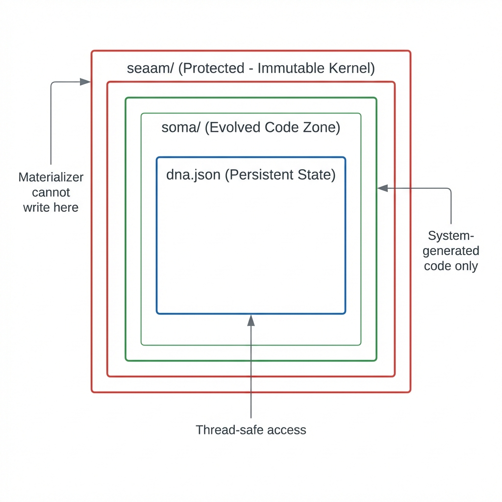

# ⚙️ Operations Manual

Complete guide to operating, configuring, and maintaining the SEAAM system.

---

## 🚀 Quick Start

### Prerequisites

| Requirement | Version | Purpose |
|-------------|---------|---------|
| Python | 3.9+ | Runtime |
| Ollama | Latest | Local LLM (default) |
| pip | Latest | Dependency management |

### Installation

```bash
# Clone the repository
git clone https://github.com/sutraworks/seaam.git
cd seaam

# Install in development mode
pip install -e .

# Or install dependencies only
pip install -r requirements.txt
```

### Running

```bash
# Start Ollama (in a separate terminal)
ollama run qwen2.5-coder:14b

# Start SEAAM
python3 main.py
```

---

## 🎛️ Command Line Interface

```bash
python3 main.py [OPTIONS]
```

| Option | Description | Example |
|--------|-------------|---------|
| `--help` | Show help message | `python3 main.py --help` |
| `--reset` | Reset to tabula rasa state | `python3 main.py --reset` |
| `--config CONFIG` | Use custom config file | `python3 main.py --config prod.yaml` |
| `--log-level LEVEL` | Override log level | `python3 main.py --log-level DEBUG` |

### Reset Behavior

The `--reset` flag performs a **Robinson Crusoe reset**:

1. Deletes all evolved organs (`soma/` directory)
2. Resets DNA to original goals only
3. Clears all failure history
4. System re-evolves from scratch

```bash
# Watch the system rebuild from nothing
python3 main.py --reset
```

---

## 📁 Configuration

SEAAM uses a layered configuration system:

```
Priority (highest wins):
1. Environment variables
2. config.yaml
3. Built-in defaults
```

### `config.yaml` Reference

```yaml
# SEAAM Configuration File
# All values shown are defaults

# LLM Provider Settings
llm:
  provider: ollama              # 'ollama' or 'gemini'
  model: qwen2.5-coder:14b      # Model to use
  temperature: 0.1              # Lower = more deterministic
  max_retries: 3                # Retry attempts for code generation
  timeout_seconds: 120          # Request timeout
  
  # Ollama-specific
  ollama_url: http://localhost:11434/api/generate
  
  # Gemini-specific
  gemini_model: gemini-1.5-flash

# File Paths
paths:
  root: .                       # Project root
  dna: ./dna.json               # DNA file location
  soma: ./soma                  # Evolved organs directory
  prompts: ./seaam/cortex/prompts  # Prompt templates

# Evolution Settings
metabolism:
  cycle_interval_seconds: 30    # Time between evolution cycles
  max_organs_per_cycle: 3       # Max organs to evolve per cycle
  reflection_timeout_seconds: 60

# Security Settings
security:
  allow_pip_install: false      # DISABLED by default
  allowed_pip_packages:         # Packages that CAN be installed
    - watchdog
    - streamlit
    - flask
    - fastapi
    - requests
  protected_prefixes:           # Paths that cannot be modified
    - seaam.
    - seaam/

# Logging Settings
logging:
  level: INFO                   # DEBUG, INFO, WARNING, ERROR
  format: colored               # 'colored' or 'json'
  file: null                    # Optional log file path

# Metadata
version: "1.0.0"
environment: development        # 'development' or 'production'
```

### Environment Variables

| Variable | Purpose | Example |
|----------|---------|---------|
| `SEAAM_LOG_LEVEL` | Override log level | `DEBUG` |
| `SEAAM_LOG_FORMAT` | Log format | `json` |
| `SEAAM_ALLOW_PIP` | Enable pip installs | `true` |
| `SEAAM_ENV` | Environment name | `production` |
| `OLLAMA_URL` | Custom Ollama endpoint | `http://gpu-server:11434/api/generate` |
| `OLLAMA_MODEL` | Override Ollama model | `codellama:34b` |
| `GEMINI_API_KEY` | Enable Gemini fallback | `your-api-key` |

---

## 🛑 System Reset (Robinson Crusoe Protocol)

For a complete system reset to watch the system rebuild from scratch:

### Option 1: CLI Flag (Recommended)

```bash
python3 main.py --reset
```

### Option 2: Manual Reset

```bash
# 1. Stop the running process (Ctrl+C)

# 2. Delete the body (evolved organs)
rm -rf soma/

# 3. Reset DNA to tabula rasa
cat > dna.json << 'EOF'
{
  "goals": [
    {"text": "I must be able to perceive the file system.", "created_at": "2026-01-01T00:00:00Z", "achieved": false},
    {"text": "I must have persistent memory.", "created_at": "2026-01-01T00:00:00Z", "achieved": false},
    {"text": "I must have a visual dashboard.", "created_at": "2026-01-01T00:00:00Z", "achieved": false}
  ],
  "blueprint": {},
  "failures": [],
  "active_modules": [],
  "metadata": {
    "system_version": "1.0.0",
    "system_name": "SEAAM",
    "created_at": "2026-01-01T00:00:00Z",
    "evolution_count": 0
  }
}
EOF

# 4. Optionally uninstall evolved dependencies (for full test)
pip uninstall watchdog streamlit -y

# 5. Restart
python3 main.py
```

---

## 🧪 Testing

### Running Tests

```bash
# Run all tests
python3 -m pytest tests/ -v

# Run with coverage
python3 -m pytest tests/ --cov=seaam --cov-report=term-missing

# Run specific test file
python3 -m pytest tests/unit/test_bus.py -v

# Run specific test
python3 -m pytest tests/unit/test_bus.py::TestEventBus::test_subscribe_and_publish -v
```

### Test Coverage

| Module | Tests | Description |
|--------|-------|-------------|
| EventBus | 12 | Subscribe, publish, async, unsubscribe, drain |
| DNA Schema | 17 | Serialization, legacy migration, operations |
| Materializer | 9 | Atomic writes, kernel protection, packages |
| Assimilator | 6 | Module loading, validation, batch |

### Code Quality

```bash
# Format code
black seaam/ tests/

# Lint code
ruff check seaam/ tests/

# Type checking (if mypy installed)
mypy seaam/
```

---

## 🔒 Security

<div align="center">
  
</div>

### Default Security Posture

SEAAM follows **security-first** principles:

| Protection | Default | Description |
|------------|---------|-------------|
| Pip Install | **Disabled** | External packages cannot be installed |
| Package Allowlist | Limited | Only approved packages can be installed |
| Kernel Protection | **Enabled** | Cannot write to `seaam/*` |
| Atomic Writes | **Enabled** | Prevents file corruption |

### Enabling Pip Install

> ⚠️ **WARNING**: Only enable if you trust the LLM and understand the risks.

```yaml
# config.yaml
security:
  allow_pip_install: true
  allowed_pip_packages:
    - watchdog
    - streamlit
    - requests
    # Add more as needed
```

Or via environment:

```bash
SEAAM_ALLOW_PIP=true python3 main.py
```

### Kernel Protection

The system **cannot** modify files with these prefixes:
- `seaam.` (module names)
- `seaam/` (file paths)

This protection is enforced in the Materializer and cannot be disabled.

---

## 🕵️ Troubleshooting

### Common Issues

#### `[ARCHITECT] Failed to structure thought`

**Symptoms:**
```
ERROR    [ARCHITECT   ] Failed to parse JSON response: ...
```

**Causes:**
- LLM outputting conversational text instead of JSON
- Invalid JSON syntax in response

**Solutions:**
1. Check Ollama is running: `curl http://localhost:11434/api/tags`
2. Try a more capable model: `qwen2.5-coder:14b` or `codellama:34b`
3. Check prompt templates in `seaam/cortex/prompts/`

---

#### `[GATEWAY] Validation FAILED: Missing start() function`

**Symptoms:**
```
WARNING  [GATEWAY     ] Validation FAILED: Missing start() function (attempt 1/3)
```

**Causes:**
- LLM not following the organ contract
- Poor prompt engineering

**Solutions:**
1. Check `seaam/cortex/prompts/agent_factory.yaml` for clear instructions
2. Try a different model
3. Increase `max_retries` in config

---

#### `[ASSIMILATOR] ImportError: No module named 'xyz'`

**Symptoms:**
```
ERROR    [ASSIMILATOR ] Failed to import soma.perception.observer: No module named 'watchdog'
```

**Causes:**
- Missing external dependency
- Pip install disabled (default)

**Solutions:**
1. Enable pip install and add package to allowlist:
   ```yaml
   security:
     allow_pip_install: true
     allowed_pip_packages:
       - watchdog
   ```
2. Or install manually: `pip install watchdog`

---

#### `[ASSIMILATOR] Rejected: Missing global start() function`

**Symptoms:**
```
ERROR    [ASSIMILATOR ] Validation failed for soma.xyz: Missing global start() function
```

**Causes:**
- Generated code doesn't have `start()` function
- Gateway validation somehow passed invalid code

**Solutions:**
1. Check the generated file in `soma/`
2. The Architect will attempt to redesign in the next cycle
3. Check `dna.json` for logged failures

---

#### EventBus Not Responding

**Symptoms:**
- Events published but handlers not called
- System appears frozen

**Solutions:**
1. Check if EventBus worker is running:
   ```python
   from seaam.kernel.bus import bus
   print(bus._worker_running)
   ```
2. Restart the system

---

### Debug Mode

For detailed diagnostics:

```bash
# Maximum verbosity
python3 main.py --log-level DEBUG

# JSON logging for parsing
SEAAM_LOG_FORMAT=json python3 main.py > seaam.log 2>&1
```

### Log Locations

| Log Type | Location |
|----------|----------|
| Console | stdout/stderr |
| File | Configure in `logging.file` |
| DNA State | `dna.json` |
| Evolved Code | `soma/` directory |

---

## 📊 Monitoring

### Health Indicators

| Indicator | Healthy | Unhealthy |
|-----------|---------|-----------|
| Evolution cycles | Regularly occurring | Stalled |
| Active organs | Growing or stable | Decreasing |
| Failure count | Low, decreasing | High, increasing |
| LLM responses | Valid JSON | Timeouts, errors |

### Checking System State

```bash
# View DNA state
cat dna.json | python3 -m json.tool

# List evolved organs
find soma/ -name "*.py" ! -name "__init__.py"

# Check running processes
ps aux | grep python
```

### DNA Analytics

```python
# Python script to analyze DNA
import json

with open("dna.json") as f:
    dna = json.load(f)

print(f"Goals: {len(dna['goals'])}")
print(f"Blueprints: {len(dna['blueprint'])}")
print(f"Active Modules: {len(dna['active_modules'])}")
print(f"Failures: {len(dna['failures'])}")
print(f"Evolution Count: {dna['metadata'].get('evolution_count', 0)}")
```

---

## 🔄 Backup & Recovery

### Backup DNA

```bash
# Create dated backup
cp dna.json "dna.backup.$(date +%Y%m%d-%H%M%S).json"

# Automatic backups are stored in dna.json.bak
ls -la dna.json*
```

### Backup Evolved Organs

```bash
# Archive soma directory
tar -czf "soma.backup.$(date +%Y%m%d).tar.gz" soma/
```

### Recovery

```bash
# Restore DNA
cp dna.backup.20260130-120000.json dna.json

# Restore soma
tar -xzf soma.backup.20260130.tar.gz
```

---

## 🚦 Production Deployment

### Configuration for Production

```yaml
# config.yaml (production)
llm:
  provider: ollama
  model: codellama:34b
  max_retries: 5

security:
  allow_pip_install: false  # Keep disabled in production

logging:
  level: INFO
  format: json              # Machine-parseable
  file: /var/log/seaam/seaam.log

environment: production
```

### Running as a Service

```bash
# systemd service file (/etc/systemd/system/seaam.service)
[Unit]
Description=SEAAM Self-Evolving Agent
After=network.target

[Service]
Type=simple
User=seaam
WorkingDirectory=/opt/seaam
ExecStart=/usr/bin/python3 main.py
Restart=always
RestartSec=10

[Install]
WantedBy=multi-user.target
```

```bash
# Enable and start
sudo systemctl enable seaam
sudo systemctl start seaam
sudo systemctl status seaam
```

---

## 📚 Additional Resources

- [Architecture Deep Dive](ARCHITECTURE.md)
- [Design Specifications](DESIGN.md)
- [GitHub Repository](https://github.com/sutraworks/seaam)
