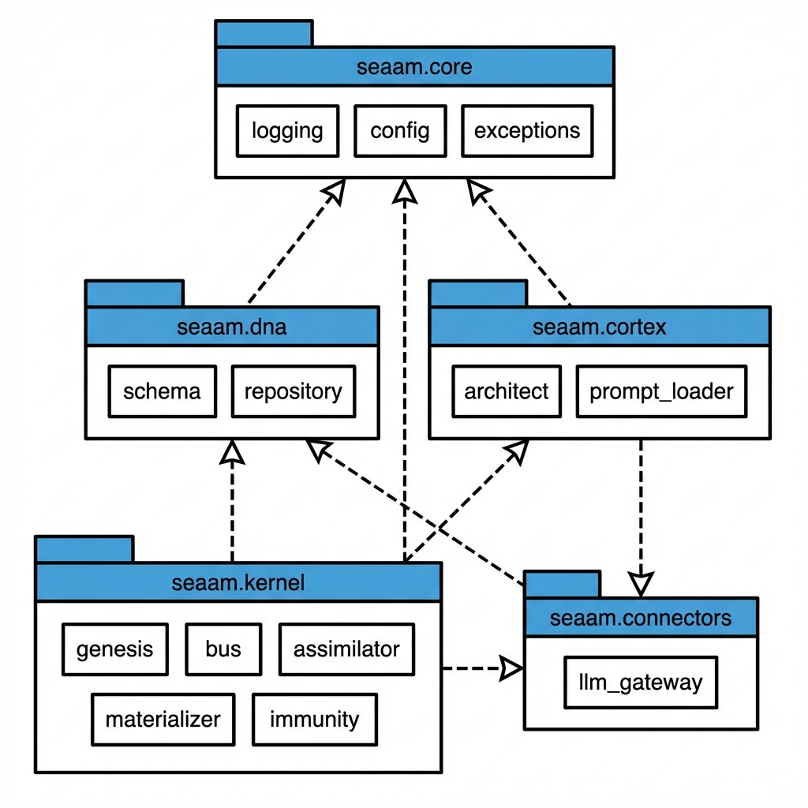

# 📂 Project Structure

Complete breakdown of the SEAA codebase after the A+ Grade refactor.

---

## Root Directory

```
sutraworks-SEAA/
├── main.py                     # Entry point with CLI commands
├── config.yaml                 # System configuration
├── dna.json                    # Persistent DNA state
├── .identity.json              # Instance identity (survives reset)
├── pyproject.toml              # Build configuration & dependencies
├── requirements.txt            # Legacy requirements (optional)
├── README.md                   # Main documentation
├── CLAUDE.md                   # AI assistant guide
│
├── seaa/                      # Core system (immutable)
├── soma/                       # Evolved organs (system-generated)
├── tests/                      # Test suite
└── docs/                       # Documentation
```

---

## Core System (`seaa/`)

The immutable kernel that cannot be modified by the system itself.

```
seaa/
├── __init__.py                 # Package exports
│
├── core/                       # 🔧 Infrastructure
│   ├── __init__.py
│   ├── logging.py              # Structured logging (JSON/colored)
│   ├── config.py               # YAML config + env overrides
│   └── exceptions.py           # Typed exception hierarchy
│
├── dna/                        # 🧬 DNA Management
│   ├── __init__.py
│   ├── schema.py               # Pydantic-style dataclasses
│   └── repository.py           # Thread-safe persistence
│
├── kernel/                     # ⚡ The Immutable Seed
│   ├── __init__.py
│   ├── genesis.py              # Slim orchestrator (~280 LOC)
│   ├── bus.py                  # Async EventBus
│   ├── assimilator.py          # Dynamic module loader
│   ├── materializer.py         # Atomic file writer
│   ├── immunity.py             # Error recovery & healing
│   ├── genealogy.py            # Evolutionary memory (Git)
│   ├── identity.py             # Instance identity (survives reset)
│   ├── beacon.py               # Health endpoint (mesh-ready)
│   ├── observer.py             # Local introspection + events
│   └── protocols.py            # Observable contracts
│
├── cortex/                     # 🧠 The Mind
│   ├── __init__.py
│   ├── architect.py            # System designer
│   ├── prompt_loader.py        # YAML template manager
│   └── prompts/                # Externalized prompt templates
│       ├── architect_reflect.yaml
│       ├── agent_factory.yaml
│       └── error_feedback.yaml
│
└── connectors/                 # 🔌 External Integrations
    ├── __init__.py
    └── llm_gateway.py          # Ollama/Gemini abstraction
```

---

## Evolved Organs (`soma/`)

System-generated code. This directory starts empty and is populated by SEAA.

```
soma/                           # 🫀 The Evolved Body
├── __init__.py                 # Auto-generated
│
├── perception/                 # Sensors
│   ├── __init__.py
│   └── observer.py             # Filesystem watcher
│
├── memory/                     # Storage
│   ├── __init__.py
│   └── journal.py              # Event logger
│
├── interface/                  # UI/API (evolvable)
│   ├── __init__.py
│   └── dashboard.py            # Web dashboard
│
├── extensions/                 # Custom metrics (evolvable)
│   └── __init__.py
│
└── mesh/                       # Fleet discovery (evolvable)
    └── __init__.py
```

> **Note**: The contents of `soma/` are examples. The actual organs depend on the system's goals. Extensions and mesh directories can be evolved to add custom observability.

---

## Test Suite (`tests/`)

Comprehensive testing with pytest - **109 tests total**.

```
tests/
├── __init__.py
├── conftest.py                 # Shared fixtures
│
├── unit/                       # Unit tests (81 tests)
│   ├── __init__.py
│   ├── test_bus.py             # EventBus (12 tests)
│   ├── test_schema.py          # DNA Schema (17 tests)
│   ├── test_materializer.py    # Materializer (16 tests) - includes security tests
│   ├── test_assimilator.py     # Assimilator (6 tests)
│   ├── test_genealogy.py       # Git memory (4 tests)
│   ├── test_auto_immune.py     # Auto-revert (3 tests)
│   └── test_observability.py   # Observability (20 tests) - identity, beacon, observer
│
└── integration/                # Integration tests (28 tests)
    ├── __init__.py
    └── test_validation.py      # Validation tests
        ├── TestCodeValidation      # AST, forbidden imports, start()
        ├── TestCircuitBreaker      # Open, close, cooldown
        ├── TestGoalSatisfaction    # Patterns, auto-satisfy
        └── TestConfigValidation    # Bounds, constraints

Security Tests (test_materializer.py):
├── TestMaterializerSecurity    # Path traversal, module validation
    ├── test_path_traversal_double_dots_rejected
    ├── test_path_traversal_many_dots_rejected
    ├── test_invalid_identifier_rejected
    ├── test_empty_component_rejected
    ├── test_non_soma_prefix_rejected
    ├── test_just_soma_rejected
    └── test_valid_deep_nesting_accepted
```

### Running Tests

```bash
# All tests
python3 -m pytest tests/ -v

# With coverage
python3 -m pytest tests/ --cov=seaa

# Specific file
python3 -m pytest tests/unit/test_bus.py -v

# Integration tests only
python3 -m pytest tests/integration/ -v
```

---

## Documentation (`docs/`)

Complete system documentation.

```
docs/
├── ARCHITECTURE.md             # System architecture deep dive
├── DESIGN.md                   # Design specifications & protocols
├── OPERATIONS.md               # Operations manual & troubleshooting
├── API.md                      # API reference
├── PROJECT_STRUCTURE.md        # This file
│
└── images/                     # Diagrams and visuals
    ├── seaa_hero_logo.png
    ├── seaa_architecture_clean.png
    ├── seaa_evolution_flow.png
    ├── seaa_dna_structure.png
    ├── seaa_module_diagram.png
    ├── seaa_event_bus.png
    └── seaa_security_layers.png
```

<div align="center">
  
  <p><em>Package dependencies - clean UML-style view</em></p>
</div>

---

## Configuration Files

### `config.yaml`

```yaml
llm:
  provider: ollama
  model: qwen2.5-coder:14b
  temperature: 0.1

security:
  allow_pip_install: false
  protected_prefixes:
    - seaa.
    - seaa/

logging:
  level: INFO
  format: colored
```

### `pyproject.toml`

```toml
[project]
name = "seaa"
version = "1.0.0"
requires-python = ">=3.9"

dependencies = [
    "requests>=2.28.0",
    "pyyaml>=6.0",
]

[project.optional-dependencies]
dev = [
    "pytest>=7.0",
    "pytest-asyncio>=0.21",
    "pytest-cov>=4.0",
    "black>=23.0",
    "ruff>=0.1.0",
]
```

### `dna.json`

```json
{
  "goals": [...],
  "blueprint": {...},
  "failures": [...],
  "active_modules": [...],
  "metadata": {...}
}
```

---

## Module Responsibilities

| Module | Location | Purpose |
|--------|----------|---------|
| **Logging** | `seaa/core/logging.py` | JSON/colored structured logging |
| **Config** | `seaa/core/config.py` | YAML + env variable configuration |
| **Exceptions** | `seaa/core/exceptions.py` | Typed exception hierarchy |
| **Schema** | `seaa/dna/schema.py` | DNA dataclass definitions |
| **Repository** | `seaa/dna/repository.py` | Thread-safe DNA persistence + **integrity verification** |
| **Genesis** | `seaa/kernel/genesis.py` | Slim orchestrator |
| **EventBus** | `seaa/kernel/bus.py` | Async pub/sub messaging |
| **Assimilator** | `seaa/kernel/assimilator.py` | Dynamic module loading + **module validation** |
| **Materializer** | `seaa/kernel/materializer.py` | Atomic file writing + **path traversal protection** |
| **Immunity** | `seaa/kernel/immunity.py` | Error recovery & healing |
| **Genealogy** | `seaa/kernel/genealogy.py` | Evolutionary memory & rollback + **config validation** |
| **Identity** | `seaa/kernel/identity.py` | Instance UUID, name, lineage - **survives reset** |
| **Beacon** | `seaa/kernel/beacon.py` | Minimal health endpoint - **mesh-ready** |
| **Observer** | `seaa/kernel/observer.py` | Local introspection + **event streaming** |
| **Protocols** | `seaa/kernel/protocols.py` | Observable contracts for **mesh interoperability** |
| **Architect** | `seaa/cortex/architect.py` | System designer + **LLM response validation** |
| **PromptLoader** | `seaa/cortex/prompt_loader.py` | YAML template management |
| **LLMGateway** | `seaa/connectors/llm_gateway.py` | LLM provider abstraction + **code validation & prompt sanitization** |

---

## Key Files

| File | Purpose |
|------|---------|
| `main.py` | CLI entry point with commands: status, organs, goals, identity, etc. |
| `config.yaml` | System configuration (LLM, paths, security, logging) |
| `dna.json` | Persistent state (goals, blueprint, failures, active modules) |
| `.identity.json` | Instance identity (survives reset) |
| `pyproject.toml` | Dependencies, build config, pytest settings |
| `CLAUDE.md` | AI assistant context guide |

---

## Data Flow

```
main.py
    ↓
Genesis (orchestrator)
    ├── DNARepository → dna.json
    ├── Architect → PromptLoader → prompts/*.yaml
    │                   ↓
    │              LLMGateway → Ollama/Gemini
    │                   ↓
    ├── Materializer → soma/**/*.py
    │                   ↓
    └── Assimilator → Running Threads
              ↓
         EventBus ←→ All Organs
```

---

## Test Coverage Summary

| Component | Tests | Coverage |
|-----------|-------|----------|
| EventBus | 12 | Subscribe, publish, async, unsubscribe, drain |
| DNA Schema | 17 | Serialization, migration, all operations |
| Materializer | 16 | Writes, protection, packages, atomic, **security** |
| Assimilator | 6 | Loading, validation, batch |
| Genealogy | 4 | Git init, commit, revert |
| Auto-Immune | 3 | Revert triggers, failure handling |
| Observability | 20 | Identity, Beacon, Observer, thread-safety, caching |
| **Integration** | **28** | Code validation, circuit breaker, goals, config |
| **Total** | **109** | **All passing** |
